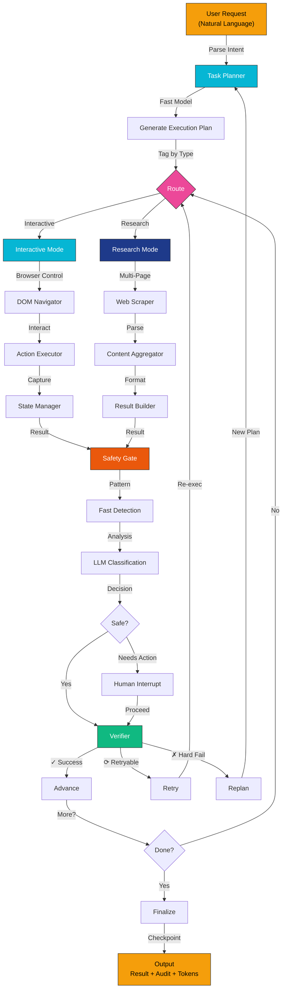

<div align="center">
  <h1>WebAtlas Agent</h1>
  <p><b>Production-grade autonomous browser agent executing complex web interactions from natural language.</b></p>
  
  <p>
    <a href="#overview">Overview</a> •
    <a href="#core-features">Features</a> •
    <a href="#architecture">Architecture</a> •
    <a href="#quick-start">Quick Start</a> •
    <a href="#configuration">Configuration</a> •
    <a href="#api-reference">API Reference</a> •
  </p>

  <p>
    
    
    
    
  </p>
</div>

---

<a id="overview"></a>
## Overview

**WebAtlas Agent** is a production-ready autonomous browser automation framework that bridges natural language understanding and complex web interactions. Unlike traditional RPA tools requiring brittle step-by-step configurations, WebAtlas automatically understands task intent, decomposes it into optimal execution steps, routes each to the appropriate backend (interactive browser control or lightweight research mode), and verifies results through multi-layer safety mechanisms.

### The Problem We Solve

Modern web automation faces critical challenges:
- **Complexity**: Tasks span multiple websites, require complex form navigation, and demand real-time decision-making
- **Brittleness**: Selector-based approaches break when UI changes occur
- **Safety**: Automation over sensitive operations (payments, credentials) requires verification mechanisms
- **Cost**: LLM-powered approaches often route all operations through expensive reasoning models
- **Adaptability**: Fixed workflows cannot handle dynamic page structures or unexpected failures

WebAtlas addresses these through intelligent routing, adaptive replanning, multi-layer safety, and optimized token consumption.

---

<a id="core-features"></a>
## 🎯 Core Features

### 1. **Intelligent Task Decomposition**
- Automatically breaks complex user instructions into atomic, executable steps
- Tags each step with optimal execution backend (interactive or research mode)
- Generates deterministic execution plans without manual configuration
- Supports logical dependencies and conditional routing

### 2. **Dual-Mode Execution Engine**

#### Interactive Mode (Browser Control)
- Real-time browser session management
- DOM interaction: clicking, form filling, navigation
- Screenshot capture and page state analysis
- Supports complex multi-step workflows (checkout flows, booking sequences)
- Per-action safety interception capability

#### Research Mode (Lightweight Aggregation)
- High-speed multi-page web scraping
- Parallel content extraction and aggregation
- Optimized for data gathering and comparison tasks
- Minimal token overhead
- Natural language search and filtering

### 3. **Multi-Layer Safety Architecture**

**Layer 1 – Pattern Detection (Fast)**
- Real-time keyword matching for payment pages, login forms, personal info
- Domain blacklist verification
- Zero LLM latency

**Layer 2 – Contextual Classification (Smart)**
- LLM-powered analysis for ambiguous scenarios
- Confidence scoring for edge cases
- Triggered only when Layer 1 is inconclusive

**Layer 3 – Human Interrupts (Control)**
- Automatic pause for credential entry, payment confirmation, destructive actions
- Resume capability with checkpoint-based state
- Full audit trail for compliance

### 4. **Token Optimization**
- **60-75% token reduction** through intelligent model selection
- Task-appropriate routing: fast/cheap models for classification, premium models for reasoning
- Eliminates redundant LLM calls via deterministic verification
- Per-backend token accounting and cost analysis

### 5. **Adaptive Execution & Resilience**
- **Auto-Replanning**: Detects page structure changes and dynamically regenerates execution plans
- **Smart Retry Logic**: Distinguishes between transient failures (retry) and hard blockers (replan)
- **State Checkpointing**: Pause and resume long-running tasks from exact execution point
- **Dry-Run Mode**: Validate execution plans before committing actions
- **Comprehensive Logging**: Full audit trail with screenshots, timings, and token metrics

### 6. **Multi-Provider LLM Support**
- **Gemini** (Google) – Free tier, excellent cost efficiency
- **Groq** – Ultra-low latency inference
- **OpenAI** (GPT-4, GPT-3.5) – Advanced reasoning
- **OpenAI-Compatible** (Nemotron, GLM, etc.) – Self-hosted or proprietary models

---

<a id="architecture"></a>
## 📐 Architecture

### Workflow Diagram



### System Design

```
        ┌──────────────────────────────────────────────────────────────┐
        │                   LANGGRAPH STATE MACHINE                    │
        ├──────────────────────────────────────────────────────────────┤
        │                                                              │
        │  ┌────────────────────────────────────────────────────────┐  │
        │  │  Task Planning Layer                                   │  │
        │  │  • NLP understanding & decomposition                   │  │
        │  │  • Backend routing (interactive vs research)           │  │
        │  │  • Execution plan generation                           │  │
        │  └────────────────────────────────────────────────────────┘  │
        │                              ↓                               │
        │  ┌────────────────────────────────────────────────────────┐  │
        │  │  Execution Layer                                       │  │
        │  │  ┌────────────────────┐  ┌──────────────────────────┐  │  │
        │  │  │ Interactive Mode   │  │ Research Mode            │  │  │
        │  │  │ • Browser session  │  │ • Web scraper            │  │  │
        │  │  │ • DOM interaction  │  │ • Content extraction     │  │  │
        │  │  │ • Screenshot mgmt  │  │ • Multi-page aggregation │  │  │
        │  │  └────────────────────┘  └──────────────────────────┘  │  │
        │  └────────────────────────────────────────────────────────┘  │
        │                              ↓                               │
        │  ┌────────────────────────────────────────────────────────┐  │
        │  │  Safety Layer (Outside Both Backends)                  │  │
        │  │  • Layer 1: Fast pattern detection                     │  │
        │  │  • Layer 2: LLM contextual classification              │  │
        │  │  • Layer 3: Human confirmation for sensitive ops       │  │
